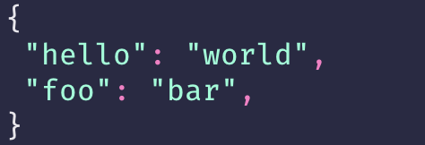
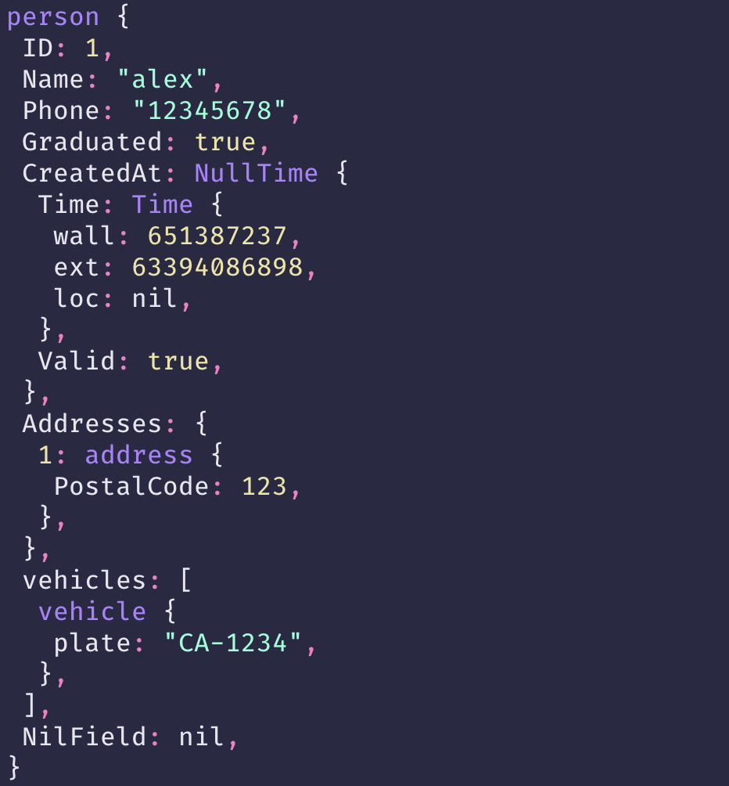

# pp

pp is a simple printer for Golang with color, currently use Rebecca colorscheme.

### Install

    go get github.com/hlcfan/pp

### Usage

``` go
import "github.com/hlcfan/pp"

pp.Puts("I'm a string")
// I'm a string

pp.PutsWithLabel("I'm a string", "DEBUG")
// DEBUG: I'm a string

```

### Examples

#### Map

```go
m := map[string]string{"foo": "bar", "hello": "world"}
pp.Puts(m)
```

*Output*



#### Complex data

```go
person := person{
  ID:        1,
  Name:      "alex",
  Phone:     "12345678",
  Graduated: true,
  CreatedAt: sql.NullTime{
    Valid: true,
    Time: time.Date(
      2009, 11, 17, 20, 34, 58, 651387237, time.UTC),
  },
  Addresses: map[int]address{
    1: {PostalCode: 123},
  },
  vehicles: []vehicle{
    {
      plate: "CA-1234",
    },
  },
}

pp.Puts(person)
```

*Output*


